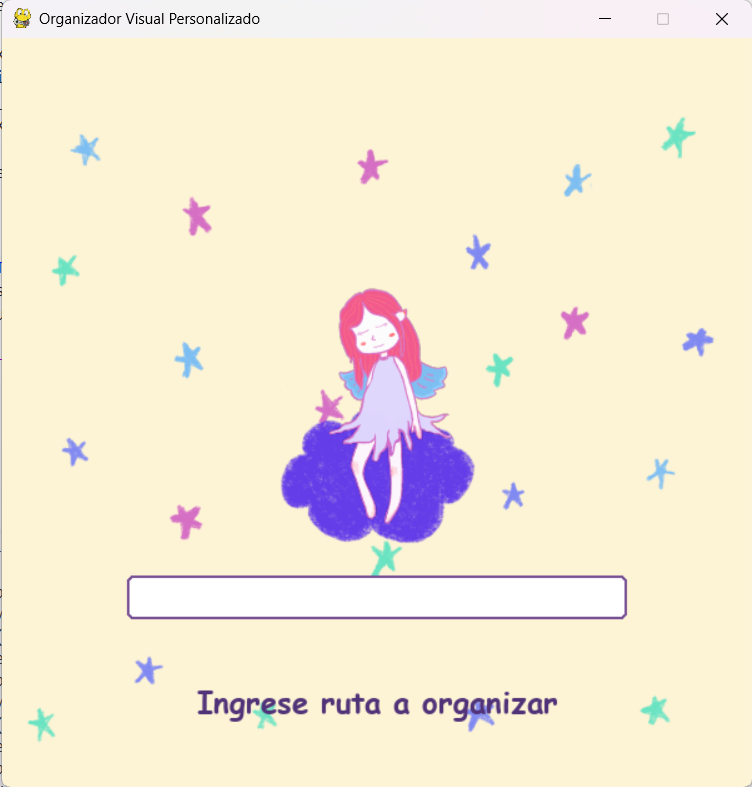
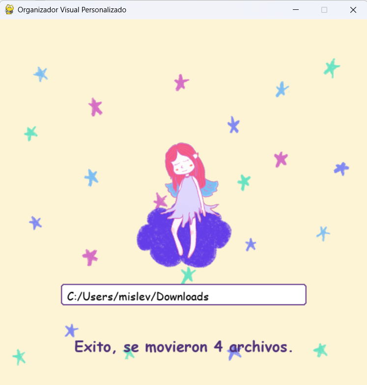
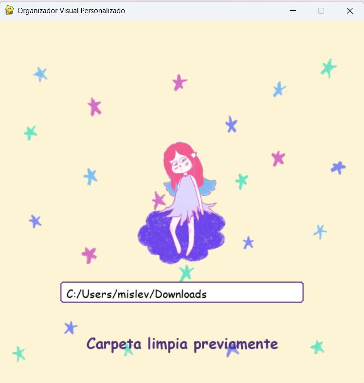

# Organizador de archivos con interfaz grafica en Pygame

## Demostración de la Interfaz

### Como se ve al entrar

### Como se ve cuando ya se limpio la carpeta

### Como se ve cuando ya se habia limpiado la carpeta previamente

## Requisitos
Para ejecutar este programa se necesita tener instalado:
* Python 3
* Pygame
* Pyperclip
